# OpenClaw — Vollständige Systemarchitektur
_Erstellt: 2026-02-26 · Basis: Live-System Wanda V5.0 · OpenClaw v2026.2.x_

> Dieses Dokument erklärt **wie OpenClaw wirklich funktioniert** — von innen. Vollständig genug um es nachzubauen.

---

## 1. Übersicht: Was ist OpenClaw?

OpenClaw ist ein **selbst-gehostetes AI-Agent-Framework**. Es läuft als Node.js-Daemon (Gateway) auf einem VPS/Server und verbindet:

- **Messaging-Kanäle** (WhatsApp, Telegram, Signal, ...) als Input/Output
- **KI-Modelle** (Anthropic, Gemini, Codex, ...) als "Gehirn" der Agenten
- **Tools** (Shell, Browser, Web, File I/O) als Hände der Agenten
- **Skills** (Markdown-Instruktionsdateien) als Spezialisierungen
- **Crons** (Scheduled Jobs) als autonome Hintergrundprozesse
- **Memory** (Files + Plugins) als persistentes Gedächtnis

---

## 2. Top-Level Architektur

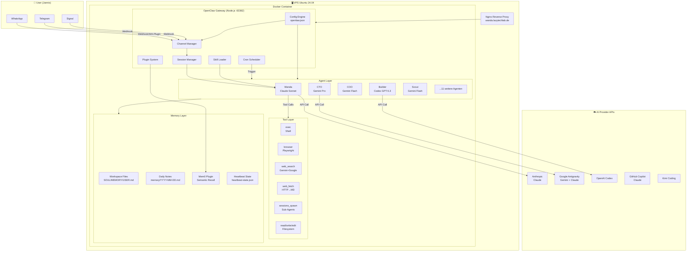

---

## 3. Message Flow (inbound → response)

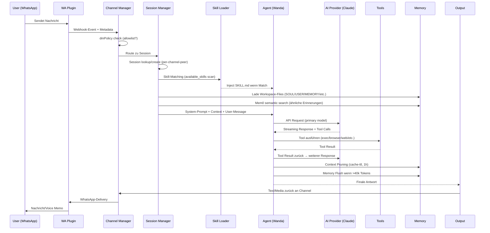

---

## 4. Konfiguration: openclaw.json (Kern-Struktur)

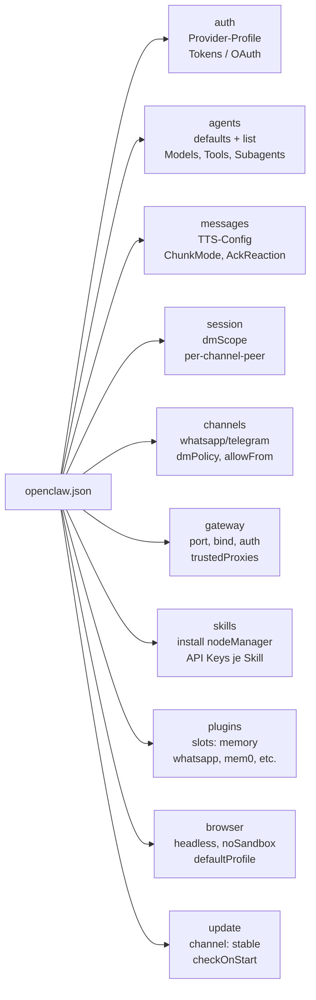

### Wichtigste Config-Abschnitte erklärt:

| Abschnitt | Zweck | Kritisch |
|-----------|-------|----------|
| `auth.profiles` | Welche AI-Provider + Auth-Methode | Ja — ohne Auth keine Modelle |
| `agents.defaults` | Globale Defaults für alle Agenten | Ja — Model-Allowlist, Context-Pruning |
| `agents.list` | Individuelle Agent-Configs | Ja — Tool-Permissions, Sub-Agent-Allow |
| `channels.whatsapp.dmPolicy` | `allowlist` = nur erlaubte Nummern | Ja — Security-kritisch |
| `messages.tts.auto` | `off` = kein auto TTS | Ja — verhindert Voice-Spam |
| `plugins.slots.memory` | Welches Memory-Plugin aktiv ist | Ja — steuert Erinnerungssystem |
| `agents.defaults.heartbeat` | Model + Interval für Heartbeat | Ja — autonomer Check-Daemon |

---

## 5. Agent-System

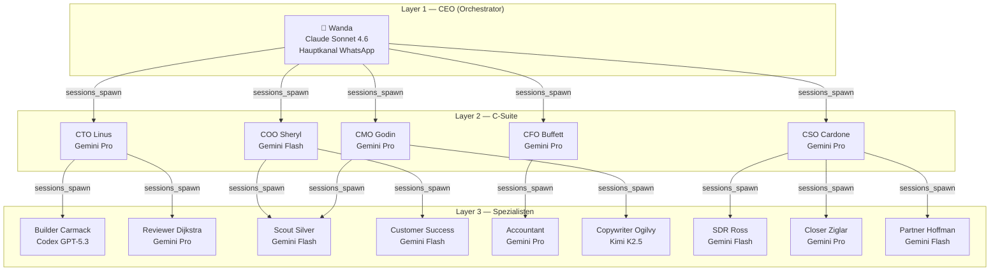

### Wie Agenten spawnen

Jeder Agent ist in `openclaw.json` definiert mit:
- **model**: primary + fallbacks
- **tools.allow/deny**: Welche Tools er nutzen darf
- **subagents.allowAgents**: Welche Agenten er spawnen darf
- **sandbox**: off/on (Isolation)

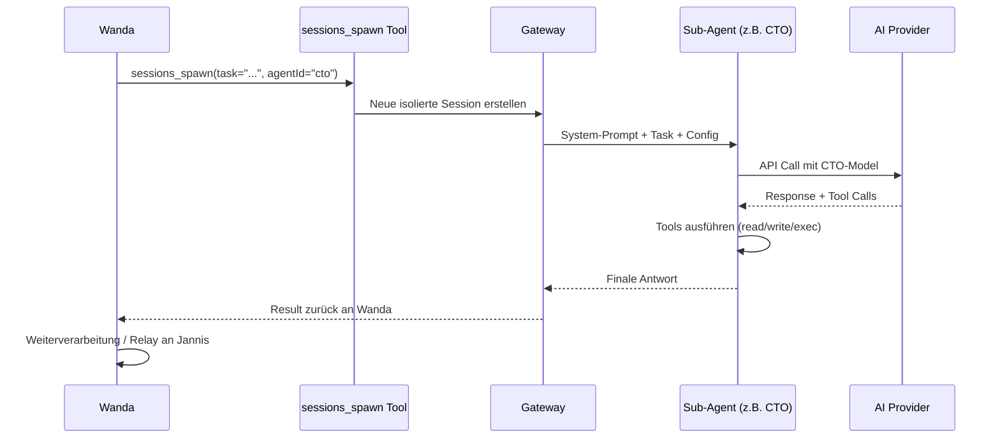

---

## 6. Cron-System

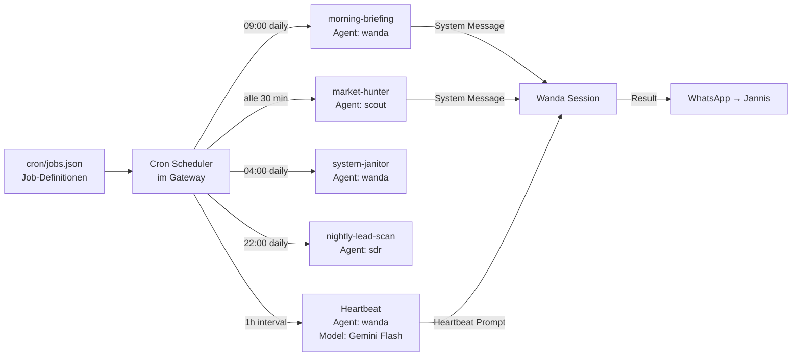

### Cron Job Schema (jobs.json)

```json
{
  "id": "morning-briefing",
  "name": "Daily CEO Briefing",
  "agentId": "wanda",
  "schedule": { "cron": "0 9 * * *", "tz": "Europe/Berlin" },
  "prompt": "Erstelle ein morgendliches CEO-Briefing...",
  "enabled": true,
  "model": "google-antigravity/gemini-3-flash"
}
```

**Kritisch:** Das `model`-Feld im Cron muss in der `agents.defaults.models` Allowlist stehen, sonst schlägt der Cron fehl mit `Unknown model`.

---

## 7. Memory-System

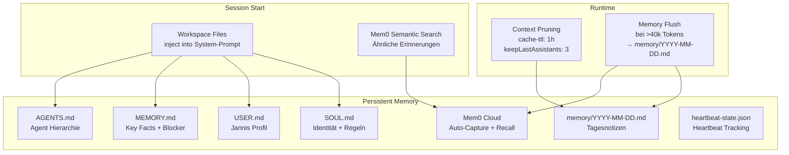

### Wie Kontext in den System-Prompt kommt

1. **Workspace Files** → werden beim Session-Start als `## Project Context` injiziert (alle .md Files im workspace)
2. **Mem0** → semantische Suche nach ähnlichen Themen → Top-N Erinnerungen werden prepended
3. **Session History** → letzte Nachrichten (kontrolliert durch contextPruning)
4. **Skill Files** → wenn Skill matched, wird SKILL.md als zusätzliche Instruktion geladen

---

## 8. Skill-System

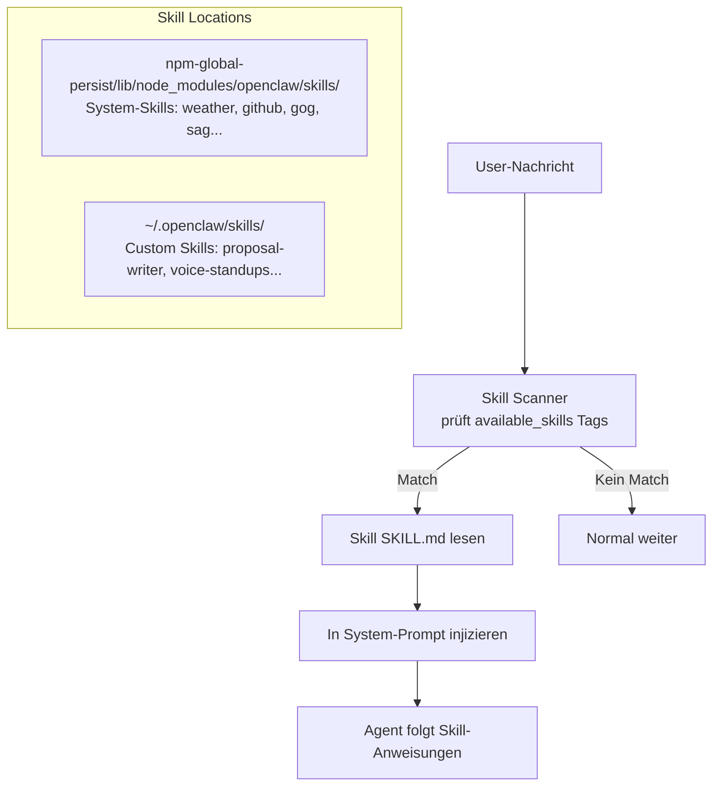

### Skill-Struktur

```
skills/
  mein-skill/
    SKILL.md          # Haupt-Instruktion (YAML frontmatter + Markdown)
    scripts/          # Hilfsskripte
    assets/           # Referenzdateien
```

**SKILL.md Frontmatter:**
```yaml
---
name: mein-skill
description: "Wann dieser Skill aktiviert wird (für Matching)"
version: "1.0"
---
# Skill Instruktionen
...
```

---

## 9. Tool-System

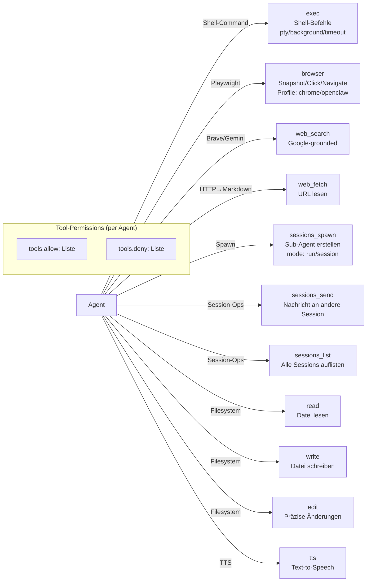

### Tool-Permissions (Beispiele)

| Agent | Erlaubt | Verboten |
|-------|---------|---------|
| Wanda (CEO) | Alles | — |
| Builder | read, write, edit, exec | browser, web_search |
| Scout | read, web_search, web_fetch, sessions_send | exec, write, browser |
| Reviewer | read, sessions_history | exec, write, browser, web |
| Accountant | read, write, edit | exec, browser, web |

---

## 10. Plugin-System

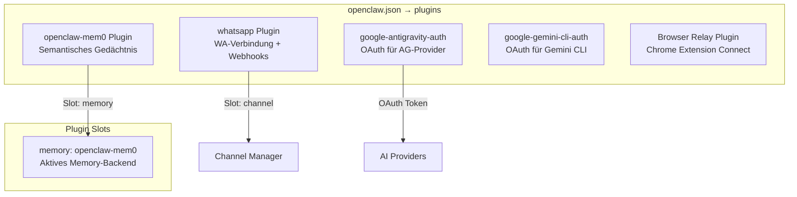

**Plugin-Slot System:** OpenClaw hat austauschbare Slots für memory (mem0, lancedb, core), channel (whatsapp, telegram), etc. Nur ein Plugin pro Slot aktiv.

---

## 11. Gateway-Architektur

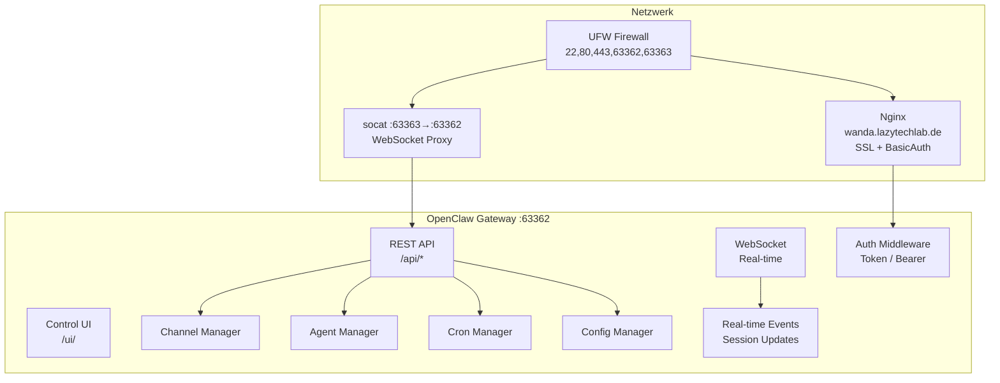

---

## 12. Session-System

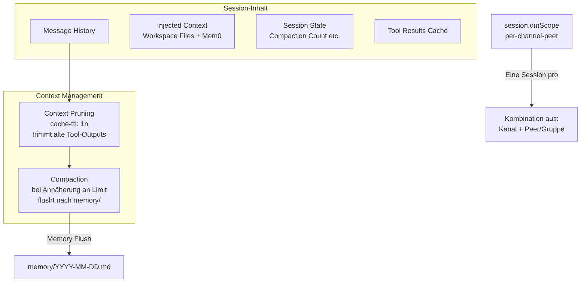

---

## 13. TTS / Voice-Pipeline

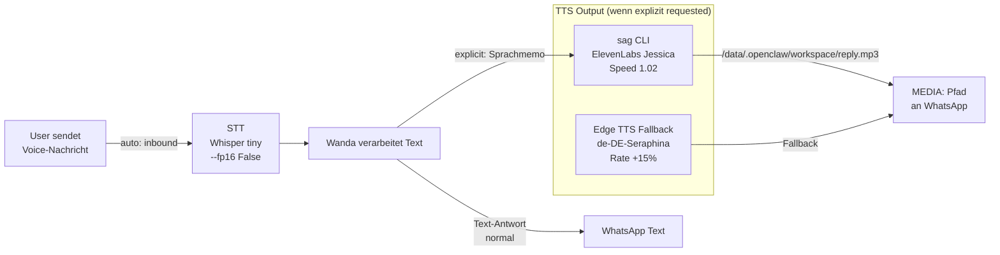

**Config-Regel:** `tts.auto: "off"` → kein auto-TTS. Nur wenn Jannis explizit "Sprachmemo" sagt → `sag speak -v cgSgspJ2msm6clMCkdW9 --speed 1.02`

---

## 14. Heartbeat-System

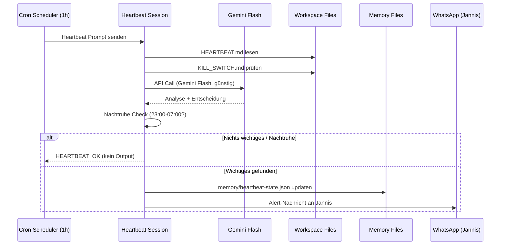

---

## 15. Auth-System (Multi-Provider)

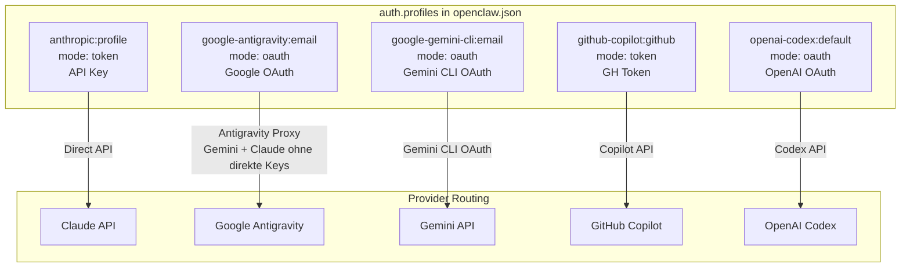

**Besonderheit Antigravity:** Google Antigravity ist ein Proxy-Provider der sowohl Gemini als auch Claude-Modelle ohne direkte Anthropic-Keys bereitstellt (über Google Cloud).

---

## 16. Kompletter Build-Stack (zum Nachbauen)

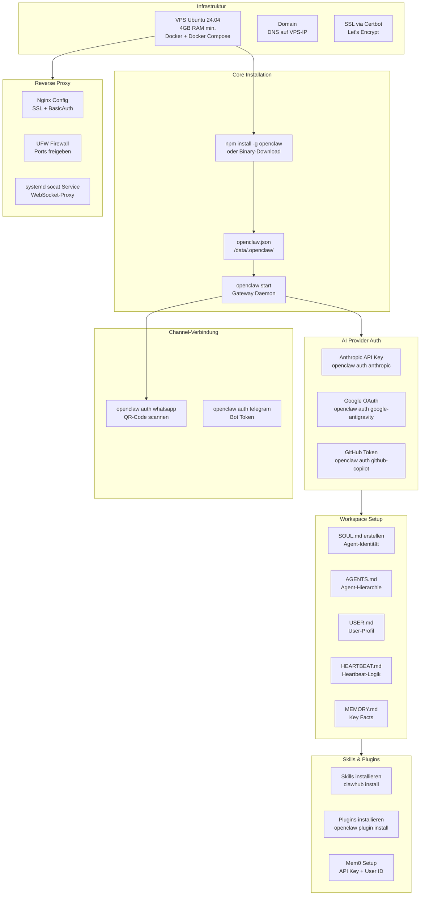

---

## 17. Warum kam das Briefing nicht als Memo? (Root Cause)

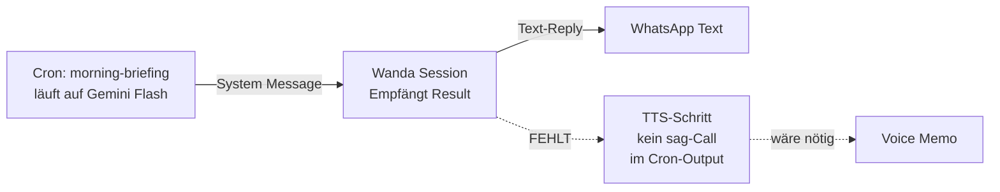

**Problem:** Der Cron produziert Text → OpenClaw liefert diesen als System-Message an Wanda → Wanda leitet ihn als Text weiter, weil `tts.auto: "off"` und der Cron keine `sag`-Instruktion hat.

**Fix-Optionen:**
1. **Cron-Prompt erweitern:** Dem Cron sagen, er soll am Ende `sag speak ...` ausführen und `MEDIA:/data/.openclaw/workspace/reply.mp3` zurückgeben
2. **Wanda-Relay-Regel:** In HEARTBEAT.md / SOUL.md definieren: "Briefings immer als Voice-Memo delivern"
3. **TTS-Auto für Briefing-Channel:** `tts.auto: "inbound"` für WhatsApp setzen (aber dann IMMER Voice, auch normal)

---

## 18. Daten-Flow: Alles auf einen Blick

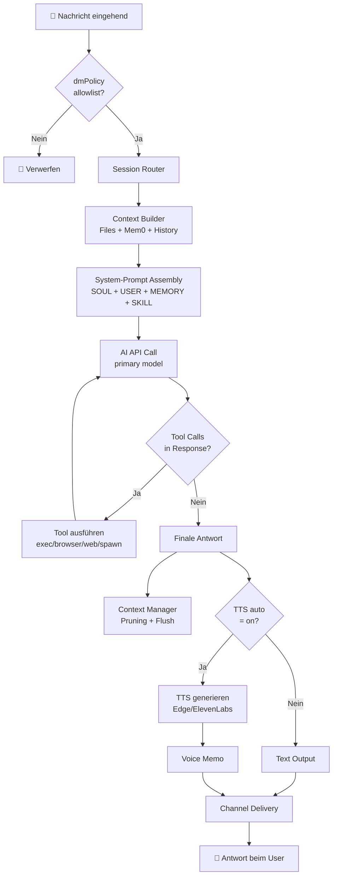

---

## 19. Minimaler Build (Eigenes OpenClaw)

Wenn du das nachbauen willst, brauchst du diese Kern-Komponenten:

| Komponente | Technologie | Zweck |
|------------|-------------|-------|
| **Gateway** | Node.js + Express | HTTP/WS Server, Config-Management |
| **Channel Plugin** | WA-Web/Baileys oder WA-Business API | WhatsApp-Verbindung |
| **Session Manager** | In-Memory + Persist | Gesprächs-Context verwalten |
| **Agent Runner** | LLM API Clients | Modelle aufrufen, Tool-Loop |
| **Tool Executor** | child_process + Playwright | exec/browser/etc. |
| **Cron Engine** | node-cron oder agenda | Scheduled Jobs |
| **Skill Loader** | fs + YAML parser | SKILL.md Dateien laden |
| **Memory System** | Markdown Files + Embeddings DB | Persistentes Gedächtnis |
| **Config Engine** | JSON Schema + Zod | openclaw.json validieren |
| **Plugin System** | Dynamic require/import | Erweiterbare Slots |

**Kritische Design-Entscheidungen:**
1. **Tool-Loop:** Agent → AI → Tool Call → Result → AI → ... (bis kein Tool mehr)
2. **Context Injection:** Workspace Files werden als System-Prompt Teil injiziert (nicht als User-Message)
3. **Session Isolation:** Sub-Agents haben eigene Sessions (kein Context-Leak nach oben)
4. **Tool-Permissions:** Per-Agent allow/deny List, erzwungen vor Tool-Execution
5. **Channel Security:** dmPolicy allowlist zuerst prüfen, bevor irgendwas verarbeitet wird

---

_Erstellt von Wanda · Stand: Live-System 2026-02-26 · Für Jannis' OpenClaw-Klon-Projekt_
